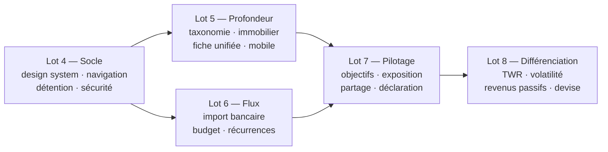

# Expression de besoin — Application Patrimoine

**Version** 1.0 · **Date** 21/08/2026 · **Auteur** Paul C. · **Statut** validée, prête pour lancement des développements

Ce document est le **point d'entrée des équipes de développement**. Il dit *ce qu'il faut construire
et pourquoi*, avec les critères permettant de juger que c'est fait. Il ne dit pas *comment* :
l'architecture existante fait foi (`docs/MANUEL_EXPLOITATION.md`), les règles métier en vigueur
aussi (`docs/SPECIFICATIONS_FONCTIONNELLES.md`). L'arbitrage détaillé de chaque point et l'historique
des décisions sont dans [`docs/BACKLOG.md`](BACKLOG.md).

---

## 1. Contexte

### 1.1 Le produit aujourd'hui

L'application est un **suivi patrimonial local, gratuit et open source**, développé depuis juillet
2026, hébergé sur le serveur personnel de l'utilisateur. Backend Python/FastAPI/SQLAlchemy/SQLite,
frontend React/TypeScript/Vite/Tailwind/Recharts. 8 481 lignes de frontend, 586 tests au vert
(442 backend, 144 frontend), code et documentation en français.

Trois phases sont livrées et vérifiées :

| Phase | Livrée | Contenu |
|---|---|---|
| 1 | 19/08/2026 | Patrimoine net : immobilier, SCPI/assurance-vie/PER, dettes |
| 2 | 19-20/08/2026 | Simulateur de projection, indépendance financière (FIRE), catégorie « autre actif » |
| 3 | 20/08/2026 | Calendrier des dividendes, relevé PDF, rapport périodique, coût de gestion consolidé, PWA |

Ce qui est **solide** et ne doit pas être perdu : la reconstruction du portefeuille depuis le grand
livre du courtier, le calcul de rentabilité (XIRR) audité, le look-through géographique et sectoriel
des ETF vérifié ligne à ligne contre justETF, l'affichage explicite de la **qualité des données**
(composition réelle / estimée / inconnue), et le fait que **rien ne sort de la machine** hors
requêtes de cotation.

### 1.2 Le déclencheur

Deux constats de l'utilisateur, formulés le 21/08/2026 :

1. **« L'UX n'est pas top. »** L'audit du frontend le confirme par la mesure, pas par le goût :
   24 classes responsives sur 8 481 lignes, aucun système de couleurs, aucun squelette de
   chargement, une navigation horizontale à neuf entrées de même rang qui ne tient pas sous
   1 000 px, une largeur de contenu plafonnée à 1 152 px sur des écrans de 1 920.
2. **Il manque des fonctions que Finary a.** Une observation directe de Finary connecté
   (`app.finary.com/v2`, 21/08/2026, compte réel) a permis de relever précisément lesquelles — et,
   aussi utile, lesquelles ne valent pas la peine d'être copiées.

### 1.3 Trois décisions de cadrage prises le 21/08/2026

Elles conditionnent tout ce qui suit et ne sont pas rediscutées dans ce document :

- **Cible d'usage : le foyer, avec exposition depuis le serveur personnel.** L'authentification
  cesse d'être hors périmètre : elle devient un préalable bloquant, avec tout ce que l'exposition
  implique (HTTPS, second facteur, sessions, journal d'accès).
- **Le budget entre dans le périmètre**, en lot dédié — import de mouvements bancaires,
  catégorisation par règles, suivi des dépenses. La catégorisation par IA est explicitement écartée.
- **L'UX/UI est un lot à part entière**, placé en tête de la file : chaque écran ajouté avant la
  refonte de l'enveloppe reproduirait les défauts mesurés.

---

## 2. Vision et principes directeurs

> **Voir tout ce que je possède et tout ce que je dois, savoir si ça monte, et comprendre pourquoi
> — sans envoyer mes données à personne, et sans payer.**

Sept principes tranchent les arbitrages qui se présenteront en cours de développement. En cas de
doute, c'est à eux qu'il faut revenir.

1. **Le patrimoine net d'abord.** Le chiffre mis en avant est ce qui reste une fois les dettes
   déduites. Finary affiche par défaut le patrimoine **brut** : sur le compte observé, 251 552 €
   affichés pour 208 328 € de passifs, soit un patrimoine réel six fois plus faible. Un indicateur
   principal qui flatte de 500 % est un défaut de conception, pas un réglage.
2. **Dire ce qu'on ne sait pas.** Une valeur estimée est signalée comme telle et **datée**. Une
   exposition déduite d'un indice n'est pas présentée comme une composition réelle. C'est déjà notre
   pratique ; elle devient une règle non négociable.
3. **Tout est gratuit et tout est visible.** Aucune fonctionnalité masquée, aucun score affiché sans
   son explication. La moitié floutée de l'écran d'analyse de Finary — « diversification
   insuffisante, 1/10 », explication payante — est le contre-modèle exact.
4. **Suivi, jamais exécution.** Aucun ordre, aucun virement, aucune action sur un compte externe.
   L'application observe et calcule.
5. **Règles explicites plutôt que modèles opaques.** La catégorisation des dépenses se fait par
   règles lisibles et corrigeables par l'utilisateur. Une classification qu'on ne peut pas corriger
   est une classification qu'on ne peut pas croire.
6. **Local par défaut.** Aucune donnée patrimoniale ne quitte le serveur. Seules sortent les
   requêtes de cotation strictement nécessaires.
7. **Un mot par chose.** Un écran a un nom, et c'est le même dans le menu, dans le titre et dans
   l'URL. Finary appelle le même écran « Patrimoine », « Portefeuille » et `/portfolio` ; on ne
   reproduit pas ça.

---

## 3. Utilisateurs et usages

| Profil | Qui | Ce qu'il fait | Fréquence |
|---|---|---|---|
| **Propriétaire** | Paul | Tout : saisie, import, réglages, gestion des membres | Hebdomadaire, plus une revue mensuelle |
| **Membre du foyer** | Conjoint | Consulte le patrimoine consolidé, saisit et modifie ses propres actifs | Mensuelle |
| **Invité** | Banquier, notaire, famille | Consulte un périmètre restreint via un lien révocable, en lecture seule | Ponctuelle |

**Parcours de référence** (celui qui doit être irréprochable) : *ouvrir l'application depuis le
téléphone, voir en moins de trois secondes le patrimoine net du foyer, sa variation depuis le début
de l'année, et ce qui explique cette variation.* Aujourd'hui ce parcours échoue sur mobile.

**Trois autres parcours structurants :**

- *Mensuel* — importer le relevé du courtier et les mouvements bancaires, vérifier que rien n'a été
  doublonné, lire le rapport du mois.
- *Trimestriel* — mettre à jour les valeurs estimées (immobilier, véhicule), vérifier les objectifs,
  regarder l'exposition consolidée.
- *Ponctuel* — produire une déclaration de patrimoine pour une banque ou un notaire, sur un
  périmètre choisi et pour un détenteur donné.

---

## 4. Périmètre

### 4.1 Dans le périmètre

Consolidation de tout le patrimoine du foyer (financier, immobilier, épargne, liquidités, objets de
valeur) et de tout son passif ; détention par personne et par société ; suivi des dépenses et du
budget ; objectifs financiers suivis dans le temps ; analyses de performance, d'exposition et de
frais ; restitution (rapports, déclaration de patrimoine, partage en lecture seule) ; accès
multi-utilisateur sécurisé depuis l'extérieur ; usage mobile.

### 4.2 Hors périmètre, et pourquoi

| Exclusion | Motif |
|---|---|
| Simulation fiscale (PEA, plus-values, IFI, revenus fonciers) | L'outil suit la performance et le patrimoine. Seule exception : un taux d'imposition **saisi** par l'utilisateur, repris tel quel dans la déclaration de patrimoine |
| Agrégation bancaire automatique commerciale (Powens, Plaid) | Contrats B2B facturés par compte connecté, incompatibles avec « gratuit ». C'est aussi la première cause de panne chez Finary |
| Achat/vente, produits de rendement intégrés | Hors philosophie : suivi, jamais exécution |
| Fonctionnalités communautaires, classement entre utilisateurs | Sans base d'utilisateurs, un percentile n'est pas calculable. L'équivalent honnête est la comparaison à un indice de référence |
| Valorisation immobilière automatique | Finary s'appuie sur PriceHubble (payant). Aucune source gratuite fiable par bien. Réponse retenue : valeur saisie et **datée** |
| Catégorisation des dépenses par IA | Non corrigeable, non explicable. Remplacée par des règles explicites |

Une piste reste ouverte mais **non engagée** : l'agrégation bancaire via Enable Banking, qui exige
une réponse écrite sur le statut réglementaire d'un usage personnel **avant tout développement**.

---

## 5. Exigences fonctionnelles

Convention : `EF-n` identifiant · chaque exigence porte le point de backlog correspondant · les
critères d'acceptation sont **vérifiables**, c'est-à-dire testables sans interprétation.

### 5.1 Lot 4 — Socle : enveloppe, détention, sécurité

#### EF-1 — Système de design *(K.1)*

Un jeu de **jetons sémantiques** (`surface`, `surface-elevee`, `bordure`, `texte`, `texte-attenue`,
`positif`, `negatif`, `accent`, `avertissement`) défini en un seul endroit et décliné clair/sombre ;
une échelle typographique à six niveaux ; une échelle de densité pour les tableaux (chiffres
tabulaires, nombres alignés à droite) ; une bibliothèque d'icônes unique remplaçant les émojis
d'interface ; les composants manquants : `Skeleton`, `EtatVide`, `EtatErreur`, `Badge`, `Tooltip`,
`SegmentedControl`, `Sheet`.

**Critères d'acceptation**
- Aucune classe de couleur `dark:` ne subsiste hors de la définition des jetons (vérifiable par
  `grep`).
- Aucun émoji ne subsiste dans un rôle d'icône d'interface.
- Chaque composant de base est couvert par un test de rendu dans les deux thèmes.
- Contraste AA vérifié sur les deux thèmes pour le texte et les éléments interactifs.

#### EF-2 — Navigation *(K.2)*

Barre latérale verticale repliable. Deux rangs séparés : consultation (*Synthèse, Patrimoine,
Analyse, Objectifs, Budget*) et administration (*Import, Réglages, Aide*), cette seconde famille
étant déplacée dans le menu du compte. Fil d'Ariane sur les pages de détail. Retour qui restitue
l'état précédent (filtres et position de défilement). Recherche globale au clavier
(`Ctrl/⌘ + K`) portant sur les positions, les biens, les emprunts et les écrans.

**Critères d'acceptation**
- Un écran porte le même nom dans le menu, dans le `<title>` et dans l'URL.
- Aucun libellé de menu n'est tronqué en français, barre repliée comme dépliée.
- Depuis une fiche de détail, le retour restaure filtre et défilement à l'identique.
- La recherche globale atteint n'importe quelle entité en moins de trois frappes après son préfixe.

#### EF-3 — Contrôles transverses *(K.3)*

Trois sélecteurs persistants dans l'en-tête, mémorisés entre les sessions et appliqués à tous les
écrans : **lentille** (`Patrimoine net` par défaut, `brut`, `financier`), **période**
(`1M 3M 6M YTD 1A 3A TOUT` + plage libre), **détenteur** (`Foyer`, une personne, une société). Un
quatrième contrôle indépendant : **masquer les montants**, qui remplace chaque valeur par des points
sans modifier les proportions des graphiques.

**Critères d'acceptation**
- Changer de lentille recalcule chiffre-clé, courbe et répartitions sur **tous** les écrans, sans
  rechargement complet.
- La sélection survit à un rafraîchissement du navigateur.
- `Patrimoine net` est la valeur par défaut à la première ouverture.
- Le masquage des montants n'altère aucune proportion graphique et ne laisse aucune valeur lisible,
  y compris dans les infobulles et les axes.

#### EF-4 — Personnes, sociétés et quotités *(L.1)*

Déclaration de **personnes** (membres du foyer) et de **sociétés** (SCI, holding), réutilisables.
Chaque actif et chaque passif porte une ou plusieurs quotités, en pourcentage. Calcul, par actif, de
la **part détenue** (quotité × valeur) et de la **part nette** (part détenue − quote-part du capital
restant dû des emprunts rattachés).

**Critères d'acceptation**
- La somme des quotités d'une ligne est contrôlée à 100 % ; une saisie non conforme est refusée avec
  un message explicite.
- Le filtre détenteur produit un patrimoine cohérent : la somme des vues individuelles égale la vue
  consolidée, au centime.
- Un actif sans quotité déclarée est réputé détenu à 100 % par le propriétaire (migration sans perte
  de données).
- La part nette d'un bien financé est vérifiée par un test sur un cas réel du foyer.

#### EF-5 — Rattachement emprunt ↔ actif *(M.2)*

Un emprunt se rattache à zéro, un ou plusieurs actifs, avec une clé de répartition. Le tableau des
passifs affiche l'actif financé ; la fiche d'un actif affiche ses emprunts et le capital restant dû
associé.

**Critères d'acceptation**
- Supprimer un actif rattaché ne supprime pas l'emprunt : il redevient non rattaché, et
  l'utilisateur en est informé.
- Le capital restant dû réparti sur les actifs égale exactement le capital restant dû de l'emprunt.

#### EF-6 — Exposition sécurisée *(L.2)*

HTTPS obligatoire (terminaison sur le reverse proxy), HSTS, cookies `Secure` + `SameSite=Strict`,
second facteur TOTP pour le compte propriétaire, limitation des tentatives avec verrouillage
temporaire, gestion des sessions (durée, liste, révocation), journal d'accès consultable dans les
réglages, sauvegarde chiffrée **planifiée**, et trois rôles : propriétaire, membre du foyer, invité.

**Critères d'acceptation**
- Une requête en HTTP simple est refusée, jamais servie.
- Après cinq échecs de connexion, le compte est verrouillé temporairement et l'événement est
  journalisé.
- Un membre du foyer ne peut ni modifier les actifs d'un autre, ni accéder aux réglages de sécurité.
- La sauvegarde s'exécute seule selon sa planification et le journal en atteste.
- Tests d'isolation des données entre utilisateurs étendus aux nouveaux rôles (prolonge le § I.5 du
  backlog).

#### EF-7 — États de chargement, vides et d'erreur *(K.5)* · **EF-8 — Menu du compte** *(K.7)*

Squelette de la forme finale pendant le chargement, jamais un texte ni un saut de mise en page. État
vide qui dit pourquoi et propose l'action. État d'erreur avec cause en français et reprise possible.
L'avatar ouvre un **menu** (compte, préférences, thème, déconnexion) au lieu de déconnecter au clic.

**Critères d'acceptation**
- Aucun écran ne présente le texte brut « Chargement… ».
- Aucune carte ne disparaît silencieusement en cas d'erreur.
- La déconnexion demande au moins une action délibérée supplémentaire.

### 5.2 Lot 5 — Profondeur du modèle et mobile

#### EF-9 — Compléter la taxonomie d'actifs *(M.1)*

Ajouter, par ordre d'utilité : comptes courants ; comptes d'épargne réglementée (Livret A, LDDS,
LEP, PEL, CEL — plafond, taux, capitalisation annuelle des intérêts) ; épargne salariale (PEE,
PERCO, PER entreprise — versements, abondement, blocage) ; véhicules (valeur avec **décote annuelle
paramétrable**, emprunt rattachable). Puis : métaux précieux (quantité × cours), crowdlending,
titres non cotés, objets de valeur typés.

**Critères d'acceptation**
- Chaque nature ajoutée est prise en compte dans le patrimoine net, dans la répartition par classe
  d'actif et dans les trois lentilles — les comptes courants étant exclus du « patrimoine
  financier ».
- Les intérêts d'un livret sont capitalisés automatiquement à la date anniversaire, et l'opération
  est traçable.
- La valeur d'un véhicule décroît seule selon la décote paramétrée, sans intervention.

#### EF-10 — Fiche immobilier complète *(M.3)*

Bloc **location** : type (nue, meublée, Pinel, LMNP…), périodicité, loyer mensuel, charges
mensuelles, frais annuels. **Cashflow mensuel** = loyer − charges − frais/12 − mensualité de
l'emprunt rattaché. **Rentabilité brute et nette** affichées côte à côte avec leur formule. Prix au
m², surface, pièces, année, DPE. **Historique de valorisation** : chaque valeur estimée est datée et
conservée, elle alimente la courbe ; l'interface affiche « estimation saisie le … ».

**Critères d'acceptation**
- Le cashflow et les deux rentabilités sont vérifiés par des tests sur les deux biens réels du
  foyer.
- Aucune plus-value immobilière n'est affichée sans la date de l'estimation qui la produit.
- Modifier une valeur estimée n'écrase pas la précédente : elle s'ajoute à l'historique.

#### EF-11 — Fiche d'actif unifiée *(M.4)*

Toute ligne du patrimoine ouvre la même structure à trois onglets : *Aperçu* (valeur, courbe,
indicateurs propres à la nature), *Analyse* (exposition, détention, part nette), *Paramètres*
(édition sectionnée avec sommaire latéral).

**Critères d'acceptation** — les onglets *Analyse* et *Paramètres* existent pour **toutes** les
natures d'actifs, y compris celles ajoutées par EF-9 ; l'onglet *Aperçu* ne montre jamais un
indicateur non pertinent pour la nature affichée.

#### EF-12 — Mobile et responsive *(K.4)* · **EF-13 — Hiérarchie du tableau de bord** *(K.6)*

Point de rupture à 768 px. En dessous : navigation par barre inférieure à cinq entrées, tableaux
**transformés en cartes** (pas de défilement horizontal), filtres en feuille glissante, graphiques
simplifiés, cibles tactiles ≥ 44 px, aucune interaction dépendante du survol. Tableau de bord en
trois temps : le chiffre (patrimoine net, sa variation, une phrase d'explication en langage
naturel), la courbe (avec les événements marquants annotés), le détail (repliable).

**Critères d'acceptation**
- L'application est utilisable et lisible à 390 px, 768 px, 1 440 px et 1 920 px — les quatre
  formats sont testés.
- Aucun tableau ne défile horizontalement sous 768 px.
- Sur un écran large, la largeur utile du contenu suit celle de la fenêtre au lieu d'être plafonnée
  à 1 152 px.
- Le parcours de référence (§ 3) s'exécute sur mobile en moins de trois secondes après ouverture.

### 5.3 Lot 6 — Budget et flux

#### EF-14 — Import et catégorisation des mouvements *(N.1)*

Import CSV (par banque) et **OFX/QIF**. Déduplication sur (date, montant, libellé normalisé).
Catégorisation par **règles de l'utilisateur** (« libellé contient X → catégorie Y »), appliquées à
l'import et réappliquables en masse. Arbre de catégories par défaut entièrement modifiable.

**Critères d'acceptation**
- Réimporter deux fois le même relevé ne crée aucune ligne en double, et le rapport d'import indique
  le nombre de doublons écartés.
- Une règle ajoutée après coup peut être appliquée rétroactivement à tout l'historique.
- Aucune catégorisation n'est appliquée sans qu'une règle nommée puisse être désignée comme sa
  cause.

#### EF-15 — Écran Budget *(N.2)* · **EF-16 — Récurrences et abonnements** *(N.3)*

Période (1M/3M/1A/personnalisée), quatre indicateurs — **Entrées / Sorties / Disponible / Dépenses
récurrentes** —, répartition des sorties, filtres par catégorie et par compte, budget cible par
catégorie avec écart en fin de période. Détection des mouvements récurrents (même bénéficiaire,
montant stable, périodicité régulière) pour en déduire la charge fixe mensuelle et signaler les
hausses de prix.

**Critères d'acceptation**
- Les quatre indicateurs se recalculent sur toute période choisie, y compris une plage libre.
- Une récurrence détectée est confirmable ou rejetable par l'utilisateur ; un rejet est définitif.
- Une hausse de montant sur une récurrence confirmée est signalée.

#### EF-17 — Jonction budget ↔ patrimoine *(N.4)*

**Taux d'épargne réel** (épargne / revenus), **reste à vivre**, et alimentation du versement mensuel
du simulateur par le taux d'épargne observé plutôt que par une hypothèse saisie.

**Critère d'acceptation** — le simulateur propose la valeur observée, l'affiche comme telle, et
reste librement modifiable.

### 5.4 Lot 7 — Pilotage et restitution

#### EF-18 — Objectifs suivis *(O.1)*

Objectif = nom, montant cible, échéance, actifs rattachés, contributeurs. Deux courbes : trajectoire
cible et trajectoire réelle. **Diagnostic en langage naturel** (« en bonne voie », « en retard de
14 mois », « atteint ») accompagné du **rendement requis** et de la **contribution mensuelle
nécessaire**. Types prédéfinis : indépendance financière (reprend le calcul FIRE existant), épargne
de précaution, apport immobilier, remboursement anticipé.

**Critères d'acceptation**
- La valeur atteinte d'un objectif provient des actifs rattachés, jamais d'une saisie manuelle.
- Le diagnostic change de manière cohérente et testable quand la trajectoire réelle décroche.
- Un objectif conserve son historique : on peut voir quand il a décroché.

#### EF-19 — Indicateurs de situation *(O.2)*

**Matelas de sécurité** (épargne disponible / dépenses mensuelles, en mois), **taux d'endettement**
(mensualités / revenus nets), **part du patrimoine immobilisée**. Chacun affiché avec sa formule.

#### EF-20 — Exposition consolidée tous actifs *(P.1)*

Le besoin fondateur du projet : une **seule** répartition géographique et par classe d'actif,
combinant le look-through des ETF **avec** l'immobilier, les SCPI et les fonds euros. Plus les
mesures de **concentration** : part du premier émetteur, des cinq premières lignes, du premier pays.

**Critères d'acceptation**
- Un patrimoine composé d'un ETF MSCI World et d'une résidence en Île-de-France affiche une
  concentration géographique élevée et le dit explicitement.
- L'encart de qualité des données reste affiché : une exposition estimée n'est jamais présentée
  comme mesurée.

#### EF-21 — Partage révocable *(Q.1)* · **EF-22 — Déclaration de patrimoine** *(Q.2)*

Lien anonyme et révocable, avec expiration, sélection des catégories et du détenteur, et quatre
interrupteurs : partager le budget, partager les objectifs, masquer les valeurs et les quantités,
exiger un code. Déclaration de patrimoine paramétrable : sélection actif par actif, par détenteur,
reprise du profil (revenus nets, dépenses mensuelles, taux d'imposition) pour produire aussi le taux
d'endettement et le reste à vivre, horodatage, pagination, et mention de la méthode de valorisation
de chaque poste.

**Critères d'acceptation**
- Un lien révoqué est inopérant immédiatement, et l'accès tenté est journalisé.
- Un lien en lecture seule ne permet aucune écriture, y compris par appel direct à l'API.
- La déclaration d'un détenteur ne contient que ses quotités.

### 5.5 Lot 8 — Différenciation

#### EF-23 — Métriques de performance *(P.2)*

**TWR** à côté du **MWR/XIRR** existant, avec l'explication de ce que chacun mesure ; **volatilité
annualisée** ; **perte maximale** et durée de récupération ; **comparaison à un indice de
référence** choisi par l'utilisateur, sur la même période et avec la même méthode.

**Critère d'acceptation** — chaque métrique est vérifiée par un test sur une série de référence dont
le résultat attendu est connu et documenté.

#### EF-24 — Revenus passifs projetés *(P.3, absorbe C.2)*

Rendement courant du patrimoine (dividendes + coupons + loyers nets + intérêts) et projection à
12 mois, **distinguant explicitement ce qui est certain** (loyers contractuels, intérêts de livrets)
**de ce qui est estimé** (dividendes d'ETF, dont la fiabilité `yfinance` est insuffisante).

#### EF-25 — Devise de référence *(Q.3)* · **EF-26 — Formats de courtier** *(E.1)*

Devise paramétrable, conversion au cours du jour, effet de change isolé dans la performance.
Élargissement des formats d'export de courtier reconnus — **bloqué** tant qu'aucun fichier réel d'un
autre courtier n'est disponible : ce n'est pas une question de priorité.

---

## 6. Exigences UX/UI

Ces exigences s'appliquent transversalement et conditionnent la recette de **chaque** lot.

| Réf | Exigence | Vérification |
|---|---|---|
| UX-1 | Chiffre-clé lisible en moins d'une seconde : taille, contraste, variation colorée, phrase d'explication | Test utilisateur sur les 4 formats d'écran |
| UX-2 | Trois clics maximum entre l'accueil et n'importe quelle information | Cartographie des parcours |
| UX-3 | Aucun état sans réponse : chargement, vide et erreur traités sur chaque écran et chaque carte | Revue écran par écran |
| UX-4 | Cohérence lexicale : un concept, un mot, partout (menu, titre, URL, documentation) | Glossaire tenu à jour dans les spécifications |
| UX-5 | Accessibilité AA : contrastes, focus visible, navigation clavier complète, libellés ARIA | Audit automatisé + parcours clavier complet |
| UX-6 | Thème clair et sombre pilotés par les mêmes jetons, sans divergence | Capture comparative des deux thèmes par écran |
| UX-7 | Aucune donnée chiffrée sans son unité, sa devise et sa date de fraîcheur | Revue |
| UX-8 | Densité maîtrisée : au plus 7 indicateurs simultanés au-dessus de la ligne de flottaison | Revue de maquette |
| UX-9 | Aucune modale bloquante pour une tâche de saisie longue : une page ou une feuille latérale | Revue |
| UX-10 | Le masquage des montants est complet — infobulles et axes de graphiques compris | Test dédié |

**Anti-modèles explicitement proscrits**, tous relevés chez Finary le 21/08/2026 : chiffre-clé brut
par défaut ; score affiché sans son explication ; carte vide sans message ; libellé de menu tronqué ;
trois noms pour un même écran ; plus-value présentée comme un fait alors qu'elle vient d'une
estimation.

---

## 7. Exigences non fonctionnelles

| Réf | Domaine | Exigence |
|---|---|---|
| ENF-1 | Performance | Tableau de bord interactif en moins de 2 s sur un patrimoine de 100 lignes ; aucune interaction bloquant l'interface plus de 200 ms |
| ENF-2 | Performance | Import de 5 000 mouvements bancaires en moins de 30 s, en tâche de fond avec progression |
| ENF-3 | Sécurité | HTTPS exclusif, TOTP pour le propriétaire, sessions révocables, journal d'accès, verrouillage après échecs répétés |
| ENF-4 | Confidentialité | Aucune donnée patrimoniale transmise à un tiers ; seules sortent les requêtes de cotation. Vérifiable au niveau réseau |
| ENF-5 | Résilience | Sauvegarde chiffrée planifiée, restauration testée et documentée dans le manuel d'exploitation |
| ENF-6 | Qualité | Couverture de tests maintenue ou augmentée ; `tsc`, `vite build` et `oxlint` propres à chaque livraison |
| ENF-7 | Migration | Toute évolution de schéma est réversible et ne perd aucune donnée existante ; testée sur une copie de la base réelle |
| ENF-8 | Compatibilité | Chrome, Firefox et Safari, deux dernières versions majeures ; installation PWA fonctionnelle sur iOS et Android |
| ENF-9 | Exploitation | Journalisation exploitable, procédure de dépannage à jour dans `MANUEL_EXPLOITATION.md` |
| ENF-10 | Documentation | Spécifications fonctionnelles et manuel utilisateur mis à jour **dans le même lot** que la fonctionnalité, jamais après |

---

## 8. Lotissement et séquencement

| Lot | Exigences | Prérequis | Peut avancer en parallèle de |
|---|---|---|---|
| **4 — Socle** | EF-1 à EF-8 | — | — |
| **5 — Profondeur** | EF-9 à EF-13 | Lot 4 (EF-4, EF-5) | Lot 6 |
| **6 — Flux** | EF-14 à EF-17 | Lot 4 | Lot 5 |
| **7 — Pilotage** | EF-18 à EF-22 | Lots 4 et 5 ; EF-19 et EF-22 partiellement lot 6 | — |
| **8 — Différenciation** | EF-23 à EF-26 | Lot 7 | — |

**Justification de l'ordre.** Le lot 4 est indivisible et vient en premier pour deux raisons
distinctes qui pointent dans le même sens : les défauts d'enveloppe se paient à chaque écran ajouté,
et les quotités de détention comme le rattachement des emprunts sont des changements de **modèle de
données** — moins coûteux avant les écrans qui s'appuieront dessus qu'après. Les lots 5 et 6 ne
partagent aucun écran et peuvent avancer côte à côte. Le lot 7 consolide ce que les précédents ont
produit : sans quotités, pas de déclaration par détenteur ; sans actifs complets, pas d'objectifs
crédibles ; sans authentification, pas de partage. Le lot 8 est la supériorité technique sur Finary
— rien ne le bloque, rien ne le rend urgent avant que le reste soit utilisable.

---

## 9. Risques et points de vigilance

| Risque | Impact | Réponse |
|---|---|---|
| La migration vers le modèle de détention casse des calculs existants | Élevé | Défaut « 100 % propriétaire » à la migration ; réexécution de la suite complète sur copie de la base réelle avant bascule |
| L'exposition sur le serveur personnel élargit la surface d'attaque | Élevé | EF-6 est bloquant : tant qu'il n'est pas livré et vérifié, l'application ne sort pas de `localhost` |
| Les formats de relevés bancaires varient d'une banque à l'autre | Moyen | Commencer par OFX/QIF (normalisés) ; le CSV par banque est un second temps, piloté par les fichiers réellement disponibles |
| Le lot budget change la nature du produit et peut le diluer | Moyen | Le budget sert le patrimoine (EF-17) ; s'il ne s'y rattache pas, il ne se fait pas |
| La refonte UX régresse l'accessibilité acquise en août | Moyen | Les tests d'accessibilité existants sont conservés et étendus dans le même lot |
| La fiabilité des dividendes projetés reste insuffisante | Faible | EF-24 sépare le certain de l'estimé plutôt que d'abandonner |
| Le périmètre grossit au fil des lots | Moyen | Toute demande nouvelle passe par le backlog et la priorisation, jamais directement dans un lot en cours |

---

## 10. Définition de « terminé »

Un lot est livré quand **tous** les points suivants sont vrais :

1. Chaque exigence du lot a ses critères d'acceptation vérifiés, et la vérification est reproductible.
2. La suite de tests complète est au vert, couverture maintenue ou augmentée ; `tsc`, `vite build` et
   `oxlint` sont propres.
3. `SPECIFICATIONS_FONCTIONNELLES.md` et `MANUEL_UTILISATEUR.md` sont à jour **dans le même lot**.
4. Les migrations de schéma ont été jouées sur une copie de la base réelle, sans perte.
5. Les quatre formats d'écran (390 / 768 / 1 440 / 1 920 px) ont été contrôlés visuellement.
6. Le parcours clavier complet et les contrastes AA ont été vérifiés sur les écrans touchés.
7. Le lot est **un commit isolé et réversible** — `git revert` d'un lot ne casse pas les autres,
   comme pour les six lots du chantier d'août.
8. Le backlog est mis à jour : points traités marqués, décisions prises consignées.

---

## 11. Références

- [`docs/BACKLOG.md`](BACKLOG.md) — arbitrage détaillé de chaque point, sections A à Q
- [`docs/ROADMAP.md`](ROADMAP.md) — phases 1 à 3 livrées, ordre historique
- [`docs/SPECIFICATIONS_FONCTIONNELLES.md`](SPECIFICATIONS_FONCTIONNELLES.md) — règles métier en vigueur
- [`docs/MANUEL_EXPLOITATION.md`](MANUEL_EXPLOITATION.md) — architecture, exploitation, sauvegarde
- [`docs/MANUEL_UTILISATEUR.md`](MANUEL_UTILISATEUR.md) — mode d'emploi écran par écran
- [`docs/ETAT_DU_CHANTIER.md`](ETAT_DU_CHANTIER.md) — bilan du chantier d'audit d'août 2026
- [`docs/archives/AUDIT_2026-08-18.md`](archives/AUDIT_2026-08-18.md) — audit archivé, 55 points

**Sources externes** : observation directe de `app.finary.com/v2` le 21/08/2026 ·
[Avis Finary — outilsinvestisseur.fr](https://outilsinvestisseur.fr/finary-avis/) ·
[Retour d'expérience 2 ans — dealfluence.fr](https://www.dealfluence.fr/tech/finary) ·
[Analyse 2026 — epargnoo.com](https://epargnoo.com/epargnews/articles/avis-finary)
