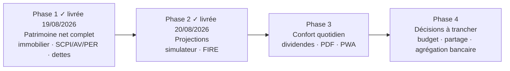

# Roadmap — vers une alternative libre et gratuite à Finary

Ce document détaille comment enchaîner les points du backlog priorisé (`docs/BACKLOG.md` § 2) pour
tendre vers la cible fixée le 19/08/2026 : une application de suivi patrimonial complet, dans
l'esprit de Finary, mais **locale, gratuite et open source**. Il complète le backlog (qui liste et
arbitre *quoi* faire) en répondant à *dans quel ordre* et *pourquoi*.

## Vision

Aujourd'hui, l'application est un **excellent tracker boursier** : reconstruction fidèle du
portefeuille depuis le grand livre de transactions, rentabilité XIRR correcte, look-through
géo/sectoriel des ETF audité ligne à ligne contre justETF, données 100 % locales. Ce qui manque pour
se rapprocher de Finary n'est pas la qualité du calcul (déjà solide, déjà testée) mais la
**largeur** : Finary montre *tout* le patrimoine d'un ménage (immobilier, épargne réglementée,
assurance-vie, dettes), pas seulement le compte-titres. La roadmap suit cette logique : élargir
d'abord ce qui est *possédé et dû*, puis ce que ça *permet de projeter*, puis le confort d'usage
quotidien.

**Ce qui est déjà acquis et qu'il ne faut pas perdre en route** : la transparence sur la qualité des
données (composition réelle vs estimée vs inconnue, affichée explicitement — Finary ne le fait pas),
le 100 % local (aucune donnée envoyée à un tiers hors requêtes de cotation strictement nécessaires),
et un score de diversification déjà gratuit alors qu'il est payant chez Finary. Ce sont des atouts
de positionnement, pas seulement des cases à cocher.

## Vue d'ensemble des phases

---

## Phase 1 — Patrimoine net complet (fondation) — livrée le 19/08/2026

**Backlog** : A.1 (immobilier), A.2 (SCPI/assurance-vie/PER), A.3 (dettes et emprunts).
**Effort total** : `L`. **Pourquoi en premier** : c'est la promesse centrale d'un agrégateur
patrimonial — *tout* voir au même endroit. Sans elle, les phases suivantes (projections, rapports)
calculeraient juste plus vite ou plus joliment un chiffre qui reste partiel. C'est aussi la phase la
moins risquée techniquement : ce sont des types d'actifs supplémentaires valorisés manuellement, sur
un modèle déjà rodé (`PRIVATE_FUND` existe déjà et suit exactement ce patron).

Étapes concrètes :

1. **Modèle de données** : trois nouveaux `type_actif` (`REAL_ESTATE`, `SCPI`, `LIFE_INSURANCE`,
   `PENSION` — quatre en réalité, voir A.2) sur `Holding`, valorisés manuellement comme
   `PRIVATE_FUND` l'est déjà (pas de tentative de cotation automatique — ce sont des supports sans
   cours quotidien). Nouveau modèle `Loan` (capital initial, taux, mensualité, dates, capital restant
   dû) — première vraie notion de **passif** dans l'application, jusqu'ici entièrement composée
   d'actifs.
2. **Patrimoine net** : le Tableau de bord distingue désormais Actifs / Passifs / **Net** (Actifs −
   Passifs), au lieu de la seule « Valeur des positions » actuelle. C'est le changement le plus
   visible de la phase, et celui qui rapproche le plus visuellement l'app de Finary.
3. **Écrans** : formulaire de saisie/édition étendu (déjà en place pour l'ajout manuel, à
   généraliser), nouvel onglet Portefeuille pour Immobilier/Épargne/Dettes (les onglets existants —
   Actions/ETF/Crypto/Obligations/Private Equity — suivent déjà ce patron, cf. LOT récent).
4. **Objectifs et répartition** : décider si ces nouveaux actifs entrent dans la répartition
   géo/sectorielle (probablement non — un bien immobilier ou une assurance-vie multi-supports n'a
   pas de géographie unique évidente) ou dans une nouvelle dimension de répartition (« par classe
   d'actif » : Actions / Immobilier / Épargne / Liquidités — c'est ainsi que Finary structure sa vue
   principale). Recommandation : ajouter cette répartition par classe d'actif plutôt que de forcer
   ces nouveaux actifs dans le look-through géo/sectoriel existant, qui n'a pas de sens pour eux.

### Ce qui a été livré (19/08/2026) — écart avec le plan ci-dessus

- **Immobilier + SCPI/assurance-vie/PER regroupés dans un seul onglet** « Immobilier & Épargne »,
  pas quatre onglets séparés comme envisagé au point 3 — leur mode de valorisation (manuel,
  `Holding.valeur_estimee`) est identique, un onglet par type aurait dispersé sans raison.
- **Les dettes ne sont PAS un onglet du tableau des positions** : un emprunt n'a ni quantité ni prix,
  sa forme de données est trop différente d'un `Holding` pour partager la même table. Livré comme
  une **carte séparée** « Dettes et emprunts » sous le tableau du Portefeuille, avec son propre CRUD.
- **Répartition par classe d'actif** (point 4) : tranchée comme prévu — nouvelle dimension, n'entre
  pas dans le look-through géo/sectoriel existant. Affichée directement dans la carte « Patrimoine
  net » du Tableau de bord (`GET /api/patrimoine/net`), pas dans un écran séparé.
- **Deux périmètres de calcul distincts et documentés** (`docs/SPECIFICATIONS_FONCTIONNELLES.md`
  § 3.11) : le portefeuille financier (`analysis_service.holdings_financiers`, exclut les 4 nouveaux
  types) reste seul consulté par le look-through géo/sectoriel, les objectifs et la carte Rentabilité
  boursière ; le patrimoine net (`patrimoine_service.py`) est une vue additive séparée.

**Vérification faite** : recette en conditions réelles sur le portefeuille de l'utilisateur (ligne
immobilière + emprunt de test, créés puis supprimés après contrôle), patrimoine net recoupé à l'euro
près (actifs − passifs), non-régression confirmée sur `/api/analysis/{annee}` et `/api/performance`
(inchangés), 378 tests backend + 93 tests frontend au vert. Détail complet dans
[`docs/BACKLOG.md`](BACKLOG.md) § 2.A.3.

---

## Phase 2 — Ce que le patrimoine permet (projections) — livrée le 20/08/2026

**Backlog** : B.1 (simulateur de patrimoine), B.2 (indépendance financière), A.4 (catégorie libre).
**Effort total** : `M`. **Pourquoi ensuite** : ces fonctionnalités n'ont de sens qu'une fois le
patrimoine net réellement complet (Phase 1) — projeter un patrimoine qui ne compte pas l'immobilier
ni les dettes donnerait une trajectoire fausse. C'est en revanche la phase à plus fort effet
d'engagement : c'est la fonctionnalité phare payante de Finary (« Predict »), reproductible ici en
calcul pur, sans aucune dépendance externe ni coût.

Étapes concrètes :

1. **Moteur de projection** : intérêts composés + apports mensuels réguliers, sur la valeur nette
   actuelle (Phase 1), avec hypothèses réglables (rendement annuel moyen, épargne mensuelle) —
   fonction pure côté backend, testable unitairement sans aucun état externe.
2. **Écran Simulateur** : graphique de trajectoire à 5/10/20/30 ans, curseurs pour les hypothèses,
   reformulé pour rester honnête (afficher une fourchette ou au moins un avertissement sur le
   caractère hypothétique — dans l'esprit de la transparence déjà pratiquée pour la qualité des
   données géographiques).
3. **Indépendance financière** : dépense annuelle cible saisie par l'utilisateur, taux de retrait
   réglable (4 % par défaut, expliqué comme un choix méthodologique et non une vérité universelle),
   date d'atteinte estimée en combinant avec le moteur de projection.
4. **Catégorie libre** (A.4) : petit complément à la Phase 1, glissé ici car sans urgence propre —
   réutilise le patron déjà construit en Phase 1, aucun nouveau mécanisme.

**Vérification faite** : chaque formule du moteur de projection verrouillée par un test comparant
son résultat à une formule fermée indépendante (capitalisation composée, valeur future d'une suite
de versements — mêmes mathématiques que l'amortissement d'emprunt de la Phase 1, appliquées en sens
inverse), pas seulement par une relecture du code. Testé en direct dans le navigateur sur le
patrimoine net réel de l'utilisateur (10 998,93 €) : projection et FIRE réactifs aux changements
d'hypothèses (le patrimoine nécessaire augmente avec un taux de retrait plus prudent, le délai
diminue avec plus d'épargne mensuelle — invariants de sens vérifiés, pas seulement de valeur). 395
tests backend (+17) + 101 tests frontend (+8). Détail complet dans [`docs/BACKLOG.md`](BACKLOG.md)
§ 2.B.2.

---

## Phase 3 — Confort et transparence au quotidien

**Backlog** : C.1 (calendrier dividendes), D.1 (relevé PDF), E.1 (formats de courtier), E.3 (coût
consolidé), H.1 (PWA). **Effort total** : `M`. **Pourquoi ici** : ce sont des améliorations
d'usage quotidien plutôt que des fondations — elles rendent l'application plus agréable à ouvrir
souvent (l'habitude d'usage est justement ce qui fait la valeur perçue d'un Finary), mais aucune
n'est bloquante pour une autre. Regroupées ensemble parce qu'elles sont indépendantes les unes des
autres et peuvent être livrées dans n'importe quel ordre interne selon l'envie du moment.

Points notables :

- **C.1** ne demande aucune nouvelle donnée (les dividendes perçus sont déjà en base) — juste une
  nouvelle vue, donc un bon point d'entrée rapide en tout début de phase.
- **D.1** (export PDF) réutilise la même logique de calcul que les CSV déjà exportables — surtout un
  travail de mise en forme.
- **E.1** élargit qui peut utiliser l'application sans changer aucun comportement pour l'utilisateur
  actuel (Trade Republic reste inchangé).
- **H.1** (PWA) est purement frontend, sans impact backend — candidat à traiter en parallèle du
  reste si besoin de varier.

---

## Phase 4 — Décisions à trancher avant d'aller plus loin

**Backlog** : F.1 (budget), E.2 (agrégation bancaire), C.2 (projection des dividendes), D.2
(rapport périodique), G.1 (partage). **Pas d'effort agrégé** : cette phase n'est pas un chantier de
développement à proprement parler, c'est une liste de **décisions produit ou de vérifications
externes** à faire avant que le développement ait un sens.

- **F.1 (budget)** : demande une décision explicite de l'utilisateur — réintroduire les mouvements
  bancaires (exclus volontairement à l'increment 5) est un changement de philosophie du produit, pas
  un simple ajout d'écran. À rediscuter en fin de Phase 3, une fois qu'on voit concrètement ce que
  l'app est devenue.
- **E.2 (agrégation bancaire)** : demande une réponse écrite d'Enable Banking sur le statut
  réglementaire d'un usage personnel avant tout code — GoCardless (l'alternative gratuite historique)
  est fermée depuis juillet 2025, ne pas repartir sur cette piste.
- **G.1 (partage)** : n'a de sens que si l'usage dépasse un seul foyer/personne — à ne considérer que
  si ce besoin apparaît réellement, plutôt qu'en anticipation.
- **C.2 et D.2** sont des extensions naturelles de C.1/D.1 (Phase 3) mais avec une précision ou une
  utilité plus incertaine (projection de dividendes approximative, rapport périodique sans mécanisme
  d'envoi puisque l'app n'a pas de serveur mail) — à réévaluer une fois C.1/D.1 livrés et leur usage
  réel observé.

---

## Ce qui reste hors périmètre quoi qu'il arrive

Voir `docs/BACKLOG.md` § 3 pour le détail et la justification : fiscalité PEA, authentification
(tant que mono-utilisateur), agrégation bancaire commerciale type Powens/Plaid, trading/rendement
crypto intégré, fonctionnalités communautaires. Aucun de ces points n'est reconsidéré par cette
roadmap — les y renvoyer explicitement évite qu'ils ne reviennent par la bande au fil des phases.
